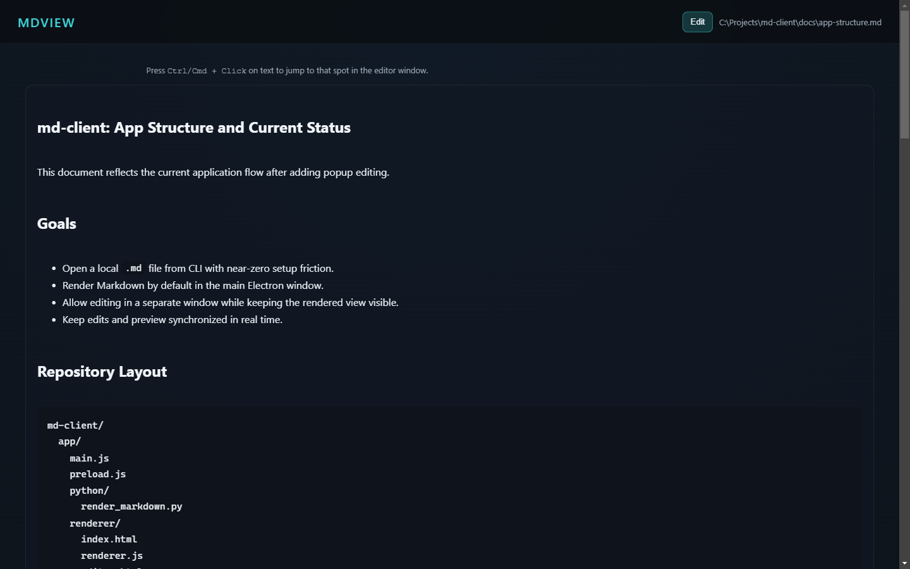
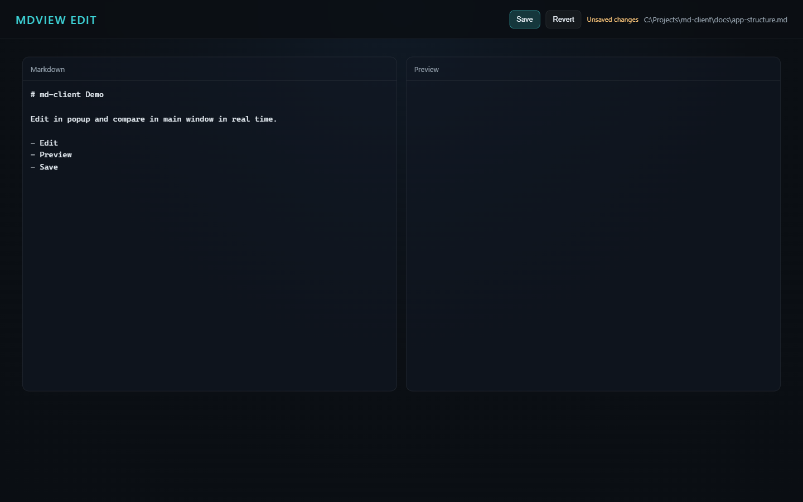

# md-client

Standalone Markdown viewer for CLI workflows. Launch it with a file path and it
opens a dark-mode Electron window with rendered Markdown plus a popup editor for
live side-by-side editing and preview.

## Setup
here som e editinig new infomration and what not 


```bash

npm install

python -m pip install -r requirements.txt
```

## Usage

```bash
node bin/mdview.js README.md
```

Optional: `npm link` to make `mdview` available on your PATH.

## Interaction Model

- Main window opens in render mode by default.
- Click `Edit` to open a separate editor popup.
- Use `Ctrl/Cmd + Click` on rendered content to open the editor and jump near
  the clicked text.
- Edit window includes:
  - Markdown source editor
  - Live preview
  - Formatting toolbar (bold, italic, link, lists, quote, code)
  - Shortcut help button (`?`) with key map
  - `Save`, `Revert`, and `Ctrl/Cmd + S`
- While typing in the popup, the main window preview updates in real time.

## Screenshots

Main render window:



Popup editor window:



## Tests

```bash
npm run test:e2e
```
